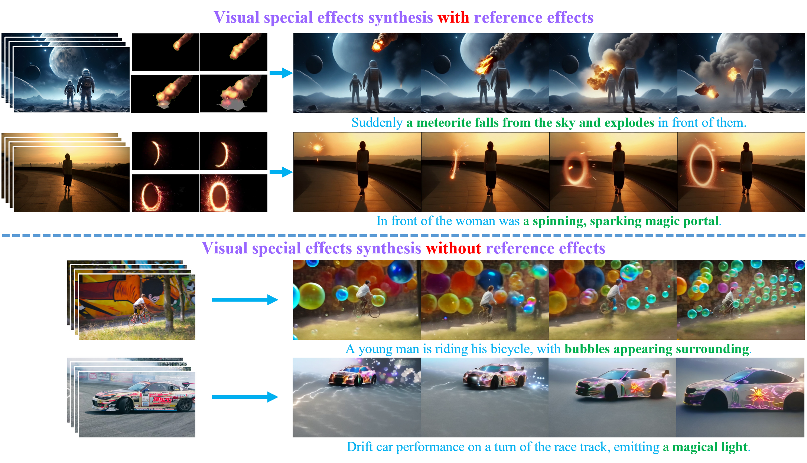
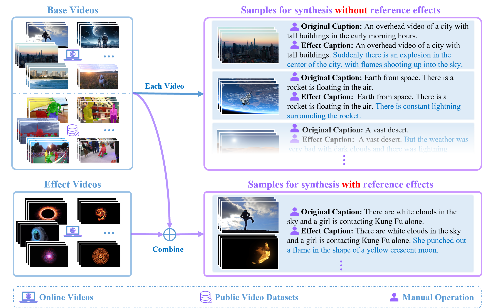
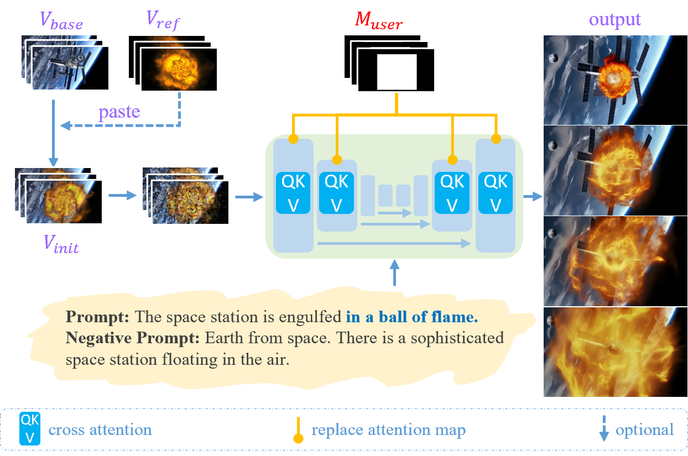

# MagicVFX: Visual Effects Synthesis in Just Minutes
This repository contains a brief introduction to the paper "MagicVFX: Visual Effects Synthesis in Just Minutes", and case presentations.


## 😁Abstract

Visual effects synthesis is crucial in the film and television industry, which aims at enhancing raw footage with virtual elements for greater expressiveness. As the demand for detailed and realistic effects escalates in modern production, professionals are compelled to allocate substantial time and resources to this endeavor. Thus, there is an urgent need to explore more convenient and less resource-intensive methods, such as incorporating the burgeoning Artificial Intelligence Generated Content (AIGC) technology. However, research into this potential integration has yet to be conducted. 

In this light, we are the first work to establish a link between visual effects synthesis and AIGC technologies.

## ❔Problem Formulation

<div align=center></div>

Depending on whether customized effects are required or not, we classify visual effects compositing into two paradigms, as shown above.

## 📁Dataset Construction

<div align=center></div>

We further collect datasets containing both base videos and effect videos and construct samples for each of the two paradigms based on these two types of videos.

<!-- We provide the dataset VFX-307 in [Baidu Cloud](https://pan.baidu.com/s/16ssAE_GlhZN4hGmvblVWew?pwd=9876).-->
We provide the dataset VFX-307 in [Baidu Cloud](https://pan.baidu.com/s/16ssAE_GlhZN4hGmvblVWew?pwd=9876).


VFX-307 dataset directory structure:

```bash
├── base_video: 
     ├── SoilHill.mp4
     ├── ManFight.mp4
     ├── ……
├── effect_video: 
     ├── scene:
          ├── snowcenter.mp4
          ├── …….mp4
     ├── object:
          ├── rockstorm.mp4
          ├── …….mp4
     ├── magic:
          ├── teleportation:
                ├── fireworkcircle.mp4
                ├── …….mp4
          ├── defence:
                ├── runsheild.mp4
                ├── …….mp4
          ├── ……
                ├── …….mp4
     ├── enviroment:
          ├── weather:
                ├── …….mp4
          ├── …… :
                ├── …….mp4
     ├── element:
          ├── smoke:
                ├── …….mp4
          ├── …… :  
                ├── …….mp4
```

<!-- ## ✏Our Pipeline -->

<!-- <div align=center></div> -->

## 🔆Ours Results

<table>
  <tr>
    <th>input</th>
    <th>Ours</th>
  </tr>
  <tr>
    <td></td>
    <td></td>
  </tr>
  <tr>
    <td></td>
    <td></td>
  </tr>
  <tr>
    <td></td>
    <td></td>
  </tr>
  <tr>
    <td></td>
    <td></td>
  </tr>
  <tr>
    <td></td>
    <td></td>
  </tr>
  <tr>
    <td></td>
    <td></td>
  </tr>
  <tr>
    <td></td>
    <td></td>
  </tr>
  <tr>
    <td></td>
    <td></td>
  </tr>
  <tr>
    <td></td>
    <td></td>
  </tr>
  <tr>
    <td></td>
    <td></td>
  </tr>
</table>

